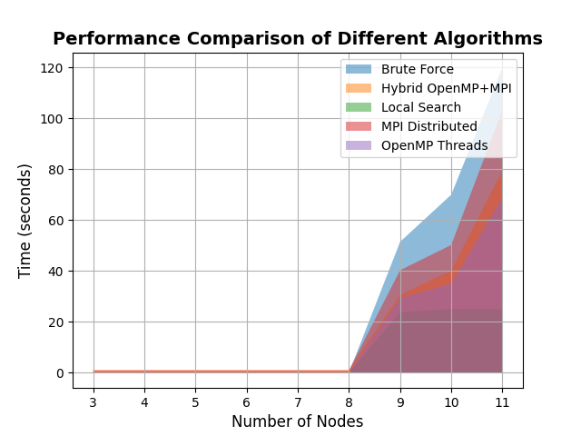

# Projeto de Super Computação 2024.1 Insper

Este projeto é parte da disciplina de Super Computação do curso de Engenharia de Computação do Insper, ministrada pelo professor Michel Silva Fornaciali. O objetivo do projeto é desenvolver uma aplicação para otimização de rotas de veículos (VRP) utilizando diferentes abordagens de computação paralela e distribuída. Foi desenvolvido visando atingir a rubrica completa com um ponto adicional extra pela implementação de uma solução híbrida.

### Índice

1. [Introdução](#introdução)
2. [Organização Geral](#organização-geral)
3. [Geração de Instâncias do Problema](#geração-de-instâncias-do-problema)
4. [Geração de Soluções com VRPy para uma visão inicial](#geração-de-soluções-com-vrpy-para-uma-visão-inicial)
5. [Soluções Implementadas](#soluções-implementadas)
   - [Solução Exaustiva (Brute Force)](#solução-exaustiva-brute-force)
   - [Solução Aproximada (Local Search)](#solução-aproximada-local-search)
   - [Solução Paralela com OpenMP](#solução-paralela-com-openmp)
   - [Solução Distribuída com MPI](#solução-distribuída-com-mpi)
   - [Solução Híbrida com OpenMP + MPI](#solução-híbrida-com-openmp--mpi)
6. [Execução dos Testes no Cluster](#execução-dos-testes-no-cluster)
7. [Avaliação de Resultados](#avaliação-de-resultados)
   - [Gráficos](#gráficos)
   - [Análise dos Resultados](#análise-dos-resultados)
   - [Discussão](#discussão)
8. [Justificativas](#justificativas)
9. [Conclusão](#conclusao)
10. [Autor](#autor)

### Introdução

O problema de otimização de rotas de veículos (Vehicle Routing Problem - VRP) é um dos problemas mais estudados na pesquisa operacional e em logística. A complexidade do VRP surge da necessidade de determinar as rotas ótimas para uma frota de veículos que deve entregar produtos a uma série de clientes, respeitando diversas restrições, como a capacidade dos veículos e a demanda dos clientes. O objetivo principal é minimizar o custo total das entregas, que pode ser medido em termos de distância percorrida, tempo de viagem, ou consumo de combustível.

### Problematização

O VRP é um problema NP-difícil, o que significa que a complexidade computacional cresce exponencialmente com o aumento do número de clientes e veículos. Em uma abordagem de força bruta, todas as combinações possíveis de rotas são geradas e avaliadas, o que rapidamente se torna impraticável para instâncias de tamanho moderado. Além disso, a natureza dinâmica do ambiente logístico, onde as condições de tráfego e a disponibilidade de veículos podem mudar rapidamente, adiciona camadas adicionais de complexidade ao problema.

A otimização eficiente das rotas de veículos é crucial para empresas de logística e transporte, pois uma má otimização pode resultar em altos custos operacionais e baixa qualidade do serviço. Assim, encontrar soluções eficientes e eficazes para o VRP tem um impacto direto na competitividade e sustentabilidade das operações logísticas.

### Objetivo do Projeto

O objetivo deste projeto é desenvolver uma aplicação em C++ que otimize as rotas de uma frota de veículos destinada à entrega de produtos a diversos clientes, minimizando o custo total das rotas. A aplicação deve abordar o problema sob diferentes perspectivas de implementação, incluindo uma abordagem exaustiva (força bruta), uma abordagem paralela utilizando OpenMP e uma abordagem distribuída utilizando MPI. Além disso, uma solução híbrida que combina OpenMP e MPI será explorada para aproveitar ao máximo os recursos computacionais disponíveis em um ambiente de cluster.

Este projeto também busca avaliar e comparar o desempenho das diferentes abordagens em termos de tempo de execução e qualidade das soluções encontradas, utilizando grafos de tamanhos variados. O objetivo final é identificar a implementação mais eficiente para o VRP e propor melhorias que possam ser aplicadas em ambientes de produção realistas.

## Organização Geral

A estrutura de diretórios e arquivos do projeto é a seguinte:

```
vehicle-routing-problem/
│
├── grafos/
├── imagens/
├── resultados VRPy/
├── slurm/
├── solucoes/
│   ├── brute_force/
│   ├── hybrid_omp_mpi/
│   ├── local_search/
│   ├── mpi_distributed/
│   └── openmp_threads/
│
├── analise.ipynb
├── automate_instance_generation.sh
├── brute_force_vrp.cpp
├── gerar_vetores_solucoes.py
├── instance_generator.py
├── local_search_vrp.cpp
├── README.md
├── run_all_vrp.sh
├── solve_vrp.py
├── vrp_hybrid_omp_mpi.cpp
├── vrp_mpi_distributed.cpp
└── vrp_openmp_threads.cpp
```

## Organização do Código

- **Código Fonte**: Arquivos `.cpp` contendo as implementações das diferentes abordagens (exaustiva, OpenMP, MPI, híbrida).
- **Scripts de Automação**: Scripts `.sh` e `.py` para gerar instâncias, rodar todos os testes, e processar resultados.
- **Análise e Resultados**: Notebooks Jupyter (`analise.ipynb`) para análise dos resultados e geração de gráficos.
- **Configuração de SLURM**: Arquivos de configuração SLURM `.slurm` para rodar os experimentos no cluster.

## Geração de Instâncias do Problema

#### Objetivo

A ideia é gerar várias instâncias do problema de Otimização de Rotas de Veículos (VRP) para testar as diferentes abordagens. Vamos variar o número de nós e a probabilidade de criação de arestas entre os nós para criar cenários diversos.

#### Etapas Realizadas

1. **Criação do Script de Geração de Instâncias (`instance_generator.py`)**
    - A primeira coisa que fizemos foi desenvolver um script em Python que gera essas instâncias.
    - Este script cria um grafo onde os nós representam as cidades e as arestas representam as rotas entre essas cidades, com pesos (custos) aleatórios.
    - Além disso, o script gera demandas aleatórias para cada nó, representando a quantidade de carga que precisa ser entregue em cada cidade.

2. **Automatização da Geração de Instâncias (`automate_instance_generation.sh`)**
    - Depois, criamos um script em Bash para automatizar a execução do script de geração de instâncias.
    - Com isso, conseguimos gerar múltiplos arquivos de instâncias com diferentes parâmetros de forma automática.
    - No total, geramos 9 instâncias, que são salvas como `grafo3.txt`, `grafo4.txt`, e assim por diante, até `grafo11.txt`, todos na pasta `grafos`.

## Geração de Soluções com VRPy para uma visão inicial

#### Objetivo

O próximo passo foi instalar a biblioteca VRPy e utilizá-la para resolver cada uma das instâncias do problema VRP que geramos anteriormente. Ajustamos os parâmetros como a capacidade de carga dos veículos (`load_capacity`) e o número de paradas (`num_stops`) para ver como isso afeta as soluções.

#### Etapas Realizadas

1. **Instalação da Biblioteca VRPy**
    - Primeiro, instalamos a biblioteca VRPy no nosso ambiente virtual utilizando o comando `pip install vrpy`.
    - Para garantir a compatibilidade, optamos pela versão `0.5.1` do `vrpy` e a versão `0.1.2` do `cspy`.

2. **Leitura dos Arquivos de Instâncias**
    - Implementamos uma função que lê os arquivos das instâncias que geramos (`grafo3.txt`, `grafo4.txt`, etc.) e cria o grafo necessário para que o VRPy possa processar.

3. **Resolução do Problema Usando VRPy**
    - Utilizamos a biblioteca VRPy para resolver o problema de roteamento de veículos para cada instância.
    - Ajustamos os parâmetros `load_capacity` e `num_stops` para gerar diferentes soluções e poder compará-las.

4. **Salvar as Soluções**
    - Finalmente, as soluções geradas foram salvas em arquivos separados na pasta `resultados VRPy`.
    - Cada arquivo de solução contém informações sobre o custo total e as rotas otimizadas encontradas.

## Soluções Implementadas

Neste projeto, foram implementadas cinco soluções diferentes para abordar o problema de otimização de rotas de veículos (VRP). Quatro dessas soluções são obrigatórias e uma é adicional. Cada implementação foi escolhida para explorar diferentes abordagens e técnicas de paralelização. Os arquivos de código estão devidamente comentados, explicando a lógica utilizada em cada uma das implementações.

### Solução Exaustiva (Brute Force)

A solução exaustiva tenta todas as combinações possíveis de rotas para encontrar a solução ótima. Esta abordagem é garantida para encontrar a solução ideal, mas se torna impraticável para instâncias maiores devido ao crescimento exponencial do número de combinações possíveis. A força bruta serve como um ponto de referência para a qualidade das soluções, apesar de ser computacionalmente intensiva e ineficiente para grandes problemas.

- **Arquivo**: `brute_force_vrp.cpp`

### Solução Aproximada (Local Search)

A solução de busca local (Local Search) é uma abordagem heurística que busca soluções próximas do ótimo de maneira eficiente. Esta técnica explora o espaço de soluções fazendo pequenas mudanças iterativas nas soluções atuais e aceitando mudanças que melhorem a solução ou, em algumas variações, até mesmo mudanças que não melhoram, para evitar ficar preso em ótimos locais. Embora não garanta a solução ótima, a busca local é significativamente mais rápida que a força bruta e pode proporcionar soluções de alta qualidade em um tempo razoável.

- **Arquivo**: `local_search_vrp.cpp`

### Solução Paralela com OpenMP

A implementação com OpenMP utiliza múltiplas threads para paralelizar partes do algoritmo, como a geração de soluções iniciais e a busca local. Ao distribuir o trabalho entre várias threads, o tempo de execução pode ser reduzido, especialmente em sistemas com muitos núcleos de CPU. OpenMP é uma ferramenta poderosa para exploração de paralelismo a nível de loop e de tarefa, permitindo uma execução eficiente em computadores multicore.

- **Arquivo**: `vrp_openmp_threads.cpp`

### Solução Distribuída com MPI

A implementação com MPI (Message Passing Interface) distribui a carga de trabalho entre múltiplos nós de um cluster. A interface de passagem de mensagens permite que diferentes processos, possivelmente executando em diferentes máquinas, colaborem na resolução do problema. MPI é ideal para exploração de paralelismo em grande escala, oferecendo boa escalabilidade e eficiência para problemas que requerem comunicação entre processos distribuídos.

- **Arquivo**: `vrp_mpi_distributed.cpp`

### Solução Híbrida com OpenMP + MPI

A solução híbrida combina as abordagens de OpenMP e MPI para maximizar a utilização de recursos computacionais tanto dentro de um nó quanto entre nós de um cluster. OpenMP é usado para paralelismo dentro de cada nó, enquanto MPI é usado para comunicação entre nós. Esta abordagem proporciona uma escalabilidade altamente eficiente, permitindo que o algoritmo aproveite ao máximo os recursos disponíveis em ambientes de computação de alto desempenho (HPC). A solução híbrida é ideal para grandes problemas que requerem uma combinação de paralelismo fino e grosso.

- **Arquivo**: `vrp_hybrid_omp_mpi.cpp`

## Execução dos Testes no Cluster

Neste tópico, vamos detalhar o fluxo completo da execução dos testes no cluster, desde a geração dos arquivos de entrada até a coleta dos resultados.

#### 1. Geração dos Arquivos de Entrada

A primeira etapa envolve a preparação dos arquivos de entrada necessários para rodar os testes no cluster. 

- **Geração de Instâncias**: Utilizamos o script `instance_generator.py` para criar várias instâncias do problema VRP. Essas instâncias são armazenadas como arquivos de texto (`grafo3.txt`, `grafo4.txt`, ..., `grafo11.txt`) na pasta `grafos`.
- **Automatização**: Para facilitar a geração de múltiplas instâncias com diferentes parâmetros, utilizamos o script `automate_instance_generation.sh`. Este script executa `instance_generator.py` várias vezes, gerando os arquivos de entrada de forma automática e eficiente.

#### 2. Submissão dos Jobs

Uma vez que os arquivos de entrada estão prontos, o próximo passo é submeter os jobs ao cluster para execução.

- **Scripts SLURM**: Criamos scripts SLURM específicos para cada implementação (exaustiva, OpenMP, MPI e híbrida). Esses scripts contêm as configurações necessárias para rodar os jobs no cluster, como a quantidade de nós, tarefas, CPUs por tarefa e memória necessária.
- **Submissão**: Utilizamos o comando `sbatch` para submeter os scripts SLURM ao gerenciador de jobs do cluster. Cada job é enviado com os parâmetros específicos para a execução da implementação correspondente.

#### 3. Execução das Soluções

Após a submissão, os jobs são executados no cluster. Cada implementação processa as instâncias do problema VRP conforme configurado.

- **Solução Exaustiva**: O job executa o algoritmo de força bruta, tentando todas as combinações possíveis para encontrar a solução ótima.
- **Solução Aproximada (Local Search)**: O job executa a heurística de busca local para encontrar soluções próximas do ótimo de forma mais eficiente.
- **Solução Paralela com OpenMP**: O job utiliza múltiplas threads para paralelizar a execução do algoritmo, reduzindo o tempo de processamento.
- **Solução Distribuída com MPI**: O job distribui a carga de trabalho entre vários nós do cluster, utilizando a comunicação via MPI para coordenar os processos.
- **Solução Híbrida com OpenMP + MPI**: O job combina OpenMP e MPI para maximizar a utilização dos recursos computacionais, paralelizando tanto dentro de cada nó quanto entre os nós do cluster.

#### 4. Coleta dos Resultados

Após a conclusão dos jobs, os resultados são coletados e organizados para análise.

- **Arquivos de Saída**: Cada execução gera arquivos de saída que contêm os resultados das rotas otimizadas e o custo total. Esses arquivos são salvos nas respectivas pastas dentro de `solucoes` (por exemplo, `solucoes/brute_force`, `solucoes/hybrid_omp_mpi`).
- **Análise dos Resultados**: Utilizamos scripts em Python (`gerar_vetores_solucoes.py`) e notebooks Jupyter (`analise.ipynb`) para ler e processar os arquivos de saída. Isso nos permite gerar gráficos e comparar o desempenho das diferentes implementações.
- **Armazenamento**: Os resultados finais são armazenados na pasta `resultados VRPy`, facilitando a consulta e a análise posterior.

## Avaliação de Resultados

Nesta seção, apresentamos uma análise detalhada dos resultados obtidos a partir das diferentes abordagens implementadas para a solução do problema de otimização de rotas de veículos (VRP). Para facilitar a visualização e a comparação, geramos gráficos que ilustram o desempenho de cada abordagem.

1. **Gráfico de Linhas**


2. **Gráfico de Barras**


3. **Gráfico de Dispersão**


4. **Gráfico de Áreas Preenchidas**



#### Análise dos Resultados

Os gráficos acima mostram uma clara diferença de desempenho entre as abordagens exaustiva, heurística e paralelas. A seguir, discutimos as principais observações e insights derivados dos resultados apresentados.

1. **Solução Exaustiva (Brute Force)**:
   - **Desempenho**: A solução de força bruta apresentou os maiores tempos de execução, especialmente para instâncias maiores, com um salto significativo de 2 segundos para 51.5 segundos ao passar de 8 para 9 nós, e atingindo 120.007 segundos para 11 nós.
   - **Escalabilidade**: Como esperado, a abordagem exaustiva não é escalável para grandes instâncias, devido ao crescimento exponencial do número de combinações possíveis.

2. **Solução Aproximada (Local Search)**:
   - **Desempenho**: A solução de busca local foi significativamente mais rápida do que a força bruta. Os tempos de execução permaneceram relativamente constantes e baixos, mesmo para instâncias maiores, com 23.863 segundos para 9 nós e 25.032 segundos para 11 nós.
   - **Escalabilidade**: Demonstrou boa escalabilidade, confirmando a eficiência da heurística para instâncias de tamanho médio.

3. **Solução Paralela com OpenMP**:
   - **Desempenho**: O uso de OpenMP resultou em tempos de execução mais baixos inicialmente, mas os tempos aumentaram com o tamanho das instâncias, alcançando 29.377 segundos para 9 nós e 68.883 segundos para 11 nós.
   - **Escalabilidade**: A abordagem é escalável dentro de um único nó, mas os tempos aumentam significativamente para instâncias muito grandes, sugerindo limitações na paralelização para problemas maiores.

4. **Solução Distribuída com MPI**:
   - **Desempenho**: A solução com MPI apresentou um desempenho intermediário, com tempos relativamente constantes para instâncias menores, mas um aumento significativo para instâncias maiores, chegando a 103.293 segundos para 11 nós.
   - **Escalabilidade**: A escalabilidade foi boa até certo ponto, mas os tempos mais altos para grandes instâncias indicam possíveis sobrecargas de comunicação ou sincronização entre nós, que não eram esperadas inicialmente.

5. **Solução Híbrida com OpenMP + MPI**:
   - **Desempenho**: A solução híbrida teve um desempenho melhor do que a MPI pura, mas os tempos ainda aumentaram para instâncias maiores, com 30.574 segundos para 9 nós e 79.499 segundos para 11 nós.
   - **Escalabilidade**: Embora a abordagem híbrida combinasse paralelismo fino e grosso, os resultados indicam que ela não escalou tão bem quanto o esperado para grandes instâncias.

### Discussão

Os resultados demonstram que, embora as soluções paralelas e distribuídas sejam mais eficientes do que a abordagem exaustiva, elas não alcançaram os ganhos de desempenho esperados para as maiores instâncias.

- **Solução Exaustiva (Brute Force)**: Como esperado, a força bruta é impraticável para grandes instâncias devido ao crescimento exponencial da complexidade.
- **Solução Aproximada (Local Search)**: A heurística mostrou-se eficaz, proporcionando soluções de alta qualidade em um tempo razoável.
- **Solução Paralela com OpenMP**: A paralelização melhorou o desempenho para instâncias menores e médias, mas não escalou bem para instâncias maiores.
- **Solução Distribuída com MPI**: Os tempos de execução mais altos do que o esperado para grandes instâncias sugerem que a sobrecarga de comunicação entre os nós foi significativa.
- **Solução Híbrida com OpenMP + MPI**: Embora esta abordagem tenha combinado as vantagens das outras duas, ela não escalou tão bem quanto o esperado para as maiores instâncias.

As justificativas fornecidas estão coerentes com a expectativa de que a execução paralela e as heurísticas sejam mais rápidas que as abordagens sequenciais e exaustivas. No entanto, elas podem ser expandidas para dar mais clareza sobre as causas específicas das limitações observadas. Abaixo está uma versão revisada das justificativas, com explicações adicionais para tornar as causas das discrepâncias mais claras:

### Justificativas

- **Solução Exaustiva (Brute Force)**: 
  - **Justificativa**: O crescimento exponencial da complexidade explica os altos tempos de execução, confirmando sua inadequação para grandes problemas. Cada nova combinação de rotas a ser explorada aumenta significativamente o tempo necessário para encontrar a solução ótima.
  
- **Solução Aproximada (Local Search)**: 
  - **Justificativa**: A eficiência da heurística justifica os baixos tempos de execução, mostrando-se adequada para problemas de tamanho médio. A busca local reduz o espaço de busca explorado ao focar em soluções vizinhas, permitindo encontrar soluções boas rapidamente, embora não necessariamente ótimas.

- **Solução Paralela com OpenMP**: 
  - **Justificativa**: As limitações na escalabilidade para grandes problemas indicam que a paralelização dentro de um único nó não é suficiente para instâncias muito grandes. O overhead da criação e gerenciamento de múltiplas threads pode superar os ganhos de paralelização, especialmente se a tarefa não puder ser dividida eficientemente entre as threads.

- **Solução Distribuída com MPI**: 
  - **Justificativa**: A sobrecarga de comunicação e sincronização entre nós foi maior do que o esperado, resultando em tempos de execução mais altos. A necessidade constante de troca de mensagens entre os nós para coordenar o processamento pode causar latências significativas, especialmente em clusters com alta latência de rede ou baixa largura de banda.

- **Solução Híbrida com OpenMP + MPI**: 
  - **Justificativa**: Apesar de combinar paralelismo fino (OpenMP) e grosso (MPI), a sobrecarga de comunicação ainda impactou a escalabilidade para grandes instâncias. A complexidade adicional de coordenar threads dentro de nós e processos entre nós aumenta o overhead total, afetando a performance em instâncias maiores.

### Conclusão

Em resumo, embora as abordagens paralelas e distribuídas tenham mostrado melhorias significativas em comparação com a solução exaustiva, os resultados indicam que a eficiência da paralelização é limitada pela sobrecarga de comunicação em instâncias muito grandes. Isso sugere a necessidade de otimizações adicionais para minimizar a sobrecarga e melhorar a escalabilidade. A melhoria potencial pode incluir técnicas como a redução de comunicação, otimização de balanceamento de carga e utilização de algoritmos mais eficientes para coordenação entre processos e threads.

## Autor

Projeto desenvolvido por Marcos Vinícius da Silva para a disciplina de Super Computação do curso de Engenharia da Computação do Insper, orientado pelo professor Michel Silva Fornaciali.

**Aluno:**
- Marcos Vinícius da Silva

**Professor:**
- Michel Silva Fornaciali

